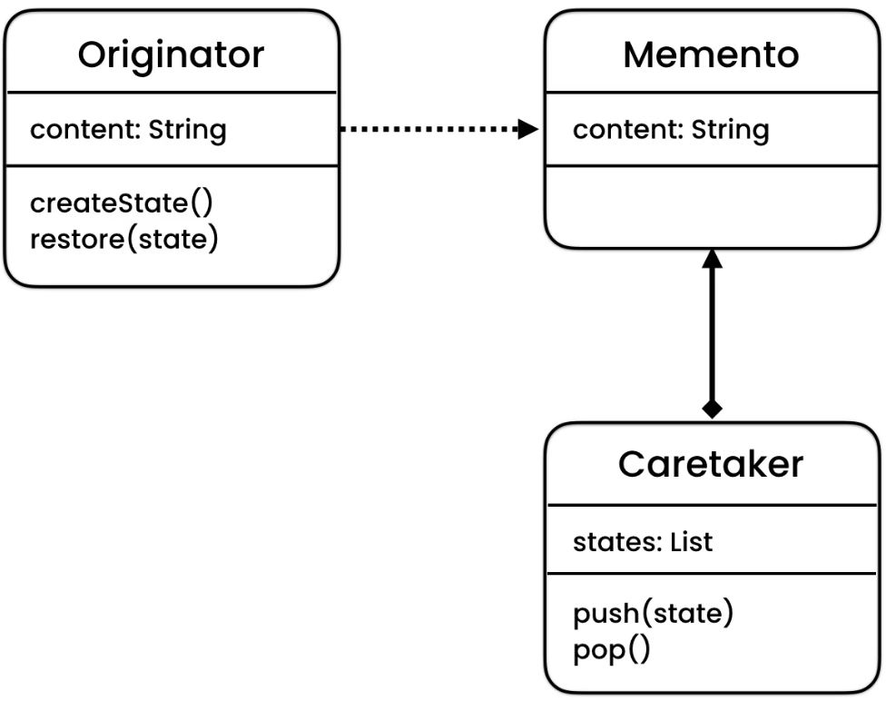
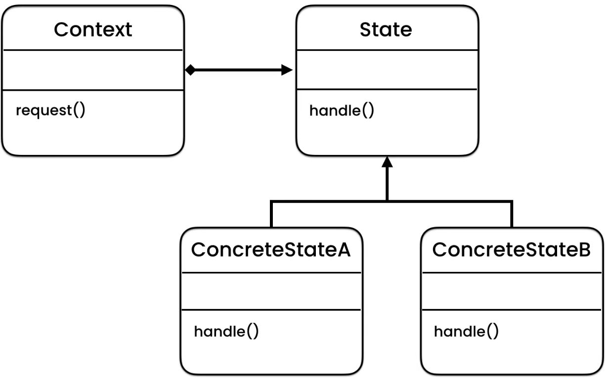
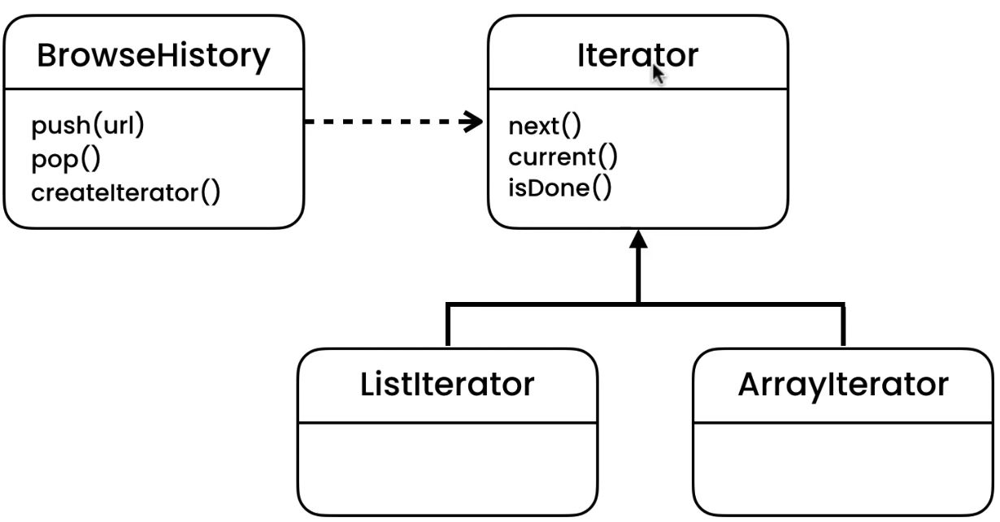
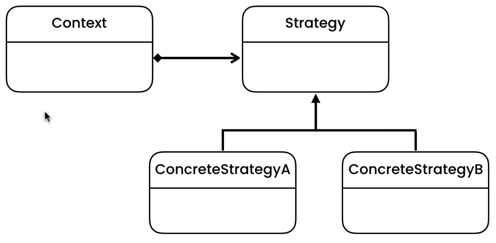
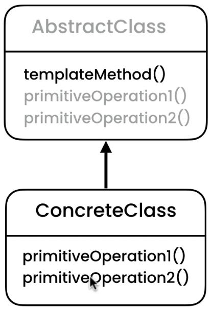
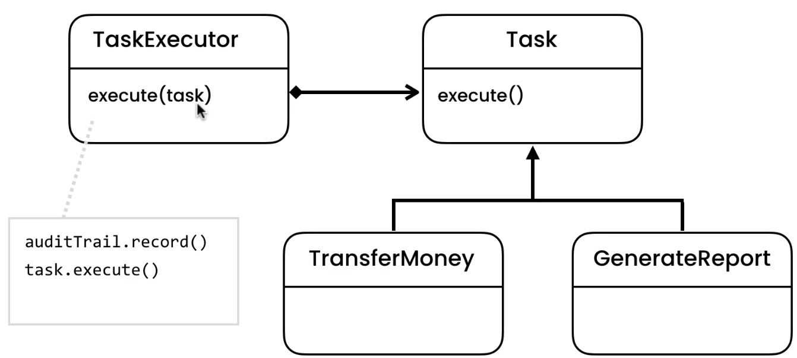
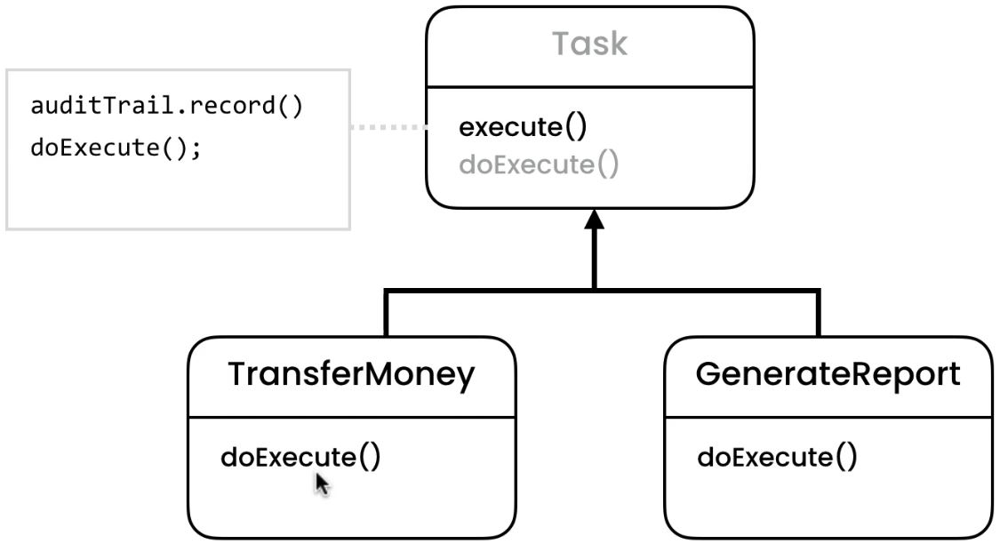
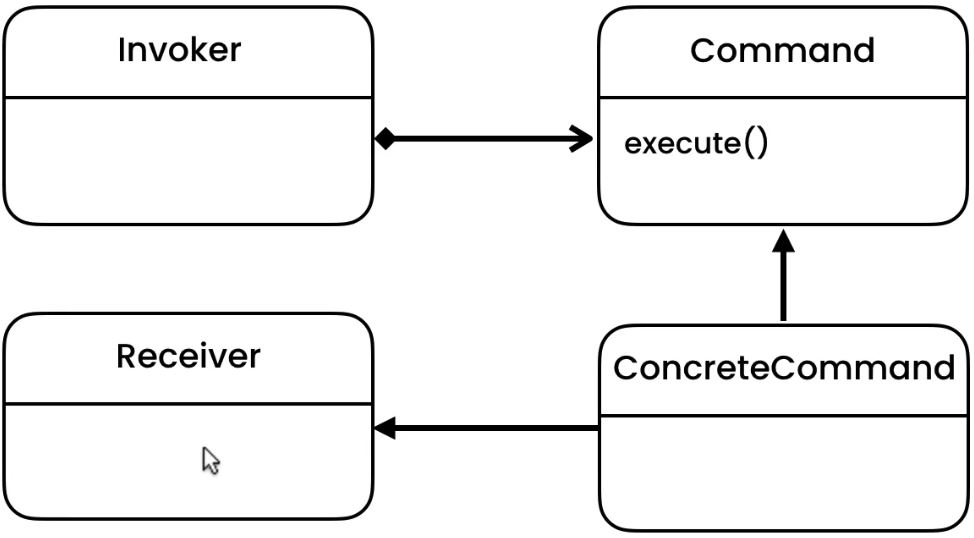
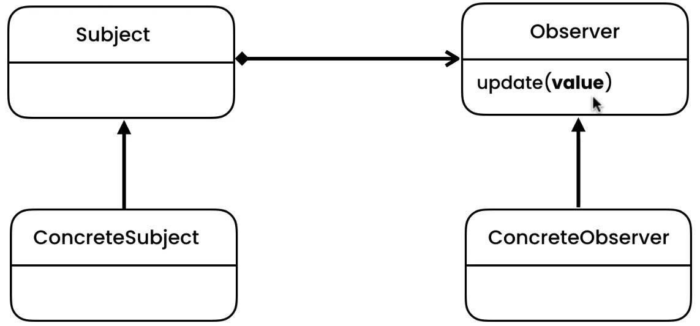
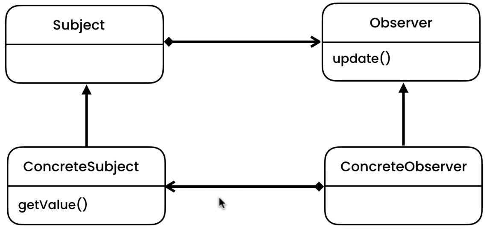

# GOF Design Patterns
 GOF design patterns implementation in JAVA

## Behavioural Patterns
Behavioural patterns characterize the ways in which classes or objects interact and distribute responsibility.

### 1. Memento

Without violating encapsulation, capture and externalize an object’s internal state so that the object can be restored to this state later. Short Definition: Pattern that used to externalize an object state usually to provide rollback functionality. (components: Originator, Caretaker, Memento) Concepts:

- Restore Object to previous state
- Externalize internal state
- Shield complex internals Examples: java.util.Date, java.io.Serializable

### 2. State

Allow an object to alter its behavior when its internal state changes. The object will appear to change its class. Short Definition: Used when we need to represent state of an application. Concepts:

- Localize state behaviour
- State Object
- Separates What from Where
- OCP (Open-Close Principle) Examples: JSF Components: Context, State, ConcreteState

### 3. Iterator

Provide a way to access the elements of an aggregate object sequentially without exposing its underlying representation. Short Definition: It's a design pattern for providing navigation without exposing of a structure of an object. Concepts:

- Traverse a container
- Doesn't expose underlying structure
- Decouples algorithms
- Sequential Examples: java.util.Iterator, java.util.Enumeration

### 4. Strategy

Define a family of algorithms, encapsulate each one, and make them interchangeable. Strategy lets the algorithm vary independently from clients that use it. Short Definition: Used when you want to enable the strategy or algorithm to be selected at runtime. Concepts:

- Eliminate conditional statements
- Behaviour encapsulated in classes
- Difficult to add new strategies
- Client aware of strategies
- Client chooses strategy Examples: java.util.Comparator Components: Context, Strategy, ConcreteStrategy

### 5. Template Method

Define the skeleton of an algorithm in an operation, deferring some steps to subclasses. Template Method lets subclasses redefine certain steps of an algorithm without changing the algorithm’s structure. Short Definition: Used to define an algorithm that allows subclasses to redefine parts of the algorithm without changing it's structure. Concepts:

- Code reuse
- Common in libraries/frameworks
- IoC
- Algorithm emphasis Examples: java.util.Collections#sort(), java.util.AbstractList#indexOf() Components: AbstractBase, ConcreteClass

Can be implemented in two ways.

#### Template - Implementation through Polymorphism

#### Template - Implementation through Inheritance

### 6. Command

Encapsulate a request as an object, thereby letting you parameterize clients with different requests, queue or log requests, and support undoable operations. Short Definition: It's a design pattern that lets you encapsulate each request as an object. Concepts:

- Encapsulate request as an Object
- Object-oriented callback
- Decouple sender from processor
- Often used for "Undo" functionality Examples: java.lang.Runnable

### 7. Observer

Define a one-to-many dependency between objects so that when one object changes state, all its dependents are notified and updated automatically. Short Definition: Observer is a decoupling pattern, when we have a subject that need to be observed by one or more observers. (Similar to Mediator) Concepts:

- One to Many
- Decoupled
- Event Handling
- Pub / Sub
- Most used in MVC Examples: java.util.Observer, java.util.EventListener, javax.jms.Topic Components: Subject, Concrete Subject, Observer, Concrete Observer

Can be implemented in two ways

#### Push Style Observer
     

    
#### Pull Style Observer
We introduce coupling at the cost if anything get changed related to observer interface we don't need to change concrete observers.
    

### 8. Mediator

Define an object that encapsulates how a set of objects interact. Mediator promotes loose coupling by keeping objects from referring to each other explicitly, and it lets you vary their interaction independently. Short Definition: Pattern that used to define how objects interacts with one another without have them refer to each other explicitly. (Similar to Observer) Concepts:

- Loose coupling
- Well-defined, but complex
- Reusable components
- Hub / Router Examples: java.util.Timer, java.lang.reflect.Method#invoke()

### 9. Chain of Responsibility

Avoid coupling the sender of a request to its receiver by giving more than one object a chance to handle the request. Chain the receiving objects and pass the request along the chain until an object handles it. Short Definition: It's behavioral pattern that decouples request from a handling object in a chain of handlers util it is finally recognized. Concepts:

- Decoupling of sender and receiver
- Receiver contains reference to next receiver
- Promotes loose coupling
- No Handler - OK Examples: java.util.logging.Logger#log(), javax.servlet.Filter#doFilter(), Spring security filters

### 10. Visitor

Represent an operation to be performed on the elements of an object structure. Visitor lets you define a new operation without changing the classes of the elements on which it operates. Short Definition: Way to separate an algorithm from an object structure. Concepts:

- Separate Algorithm from Object
- Adding new features
- Maintain Open/Closed principle
- Visitor changes Examples: java.lang.model.elementElementVisitor Components: Visitor, ConcreteVisitor, Element, ConcreteElement
