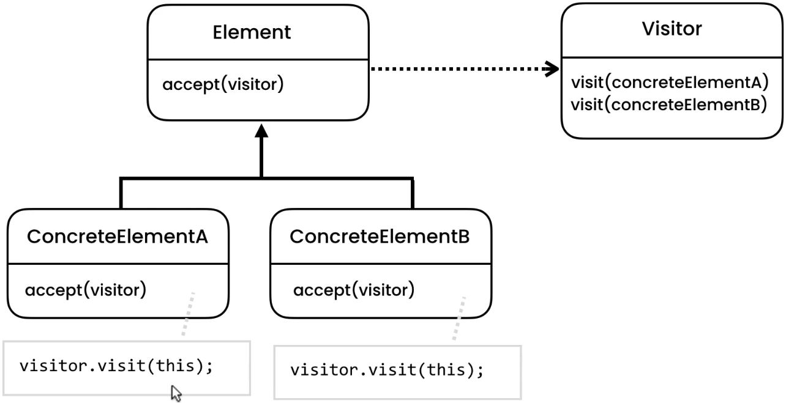

# GOF Design Patterns
 GOF design patterns implementation in JAVA

## Behavioural Patterns
Behavioural patterns characterize the ways in which classes or objects interact and distribute responsibility.

### 1. Memento

Without violating encapsulation, capture and externalize an object’s internal state so that the object can be restored to this state later. Short Definition: Pattern that used to externalize an object state usually to provide rollback functionality. (components: Originator, Caretaker, Memento) Concepts:

- Restore Object to previous state
- Externalize internal state
- Shield complex internals Examples: java.util.Date, java.io.Serializable

### 2. State

Allow an object to alter its behavior when its internal state changes. The object will appear to change its class. Short Definition: Used when we need to represent state of an application. Concepts:

- Localize state behaviour
- State Object
- Separates What from Where
- OCP (Open-Close Principle) Examples: JSF Components: Context, State, ConcreteState

### 3. Iterator

Provide a way to access the elements of an aggregate object sequentially without exposing its underlying representation. Short Definition: It's a design pattern for providing navigation without exposing of a structure of an object. Concepts:

- Traverse a container
- Doesn't expose underlying structure
- Decouples algorithms
- Sequential Examples: java.util.Iterator, java.util.Enumeration

### 4. Strategy

Define a family of algorithms, encapsulate each one, and make them interchangeable. Strategy lets the algorithm vary independently from clients that use it. Short Definition: Used when you want to enable the strategy or algorithm to be selected at runtime. Concepts:

- Eliminate conditional statements
- Behaviour encapsulated in classes
- Difficult to add new strategies
- Client aware of strategies
- Client chooses strategy Examples: java.util.Comparator Components: Context, Strategy, ConcreteStrategy

### 5. Template Method

Define the skeleton of an algorithm in an operation, deferring some steps to subclasses. Template Method lets subclasses redefine certain steps of an algorithm without changing the algorithm’s structure. Short Definition: Used to define an algorithm that allows subclasses to redefine parts of the algorithm without changing it's structure. Concepts:

- Code reuse
- Common in libraries/frameworks
- IoC
- Algorithm emphasis Examples: java.util.Collections#sort(), java.util.AbstractList#indexOf() Components: AbstractBase, ConcreteClass

Can be implemented in two ways.

#### Template - Implementation through Polymorphism

#### Template - Implementation through Inheritance

### 6. Command

Encapsulate a request as an object, thereby letting you parameterize clients with different requests, queue or log requests, and support undoable operations. Short Definition: It's a design pattern that lets you encapsulate each request as an object. Concepts:

- Encapsulate request as an Object
- Object-oriented callback
- Decouple sender from processor
- Often used for "Undo" functionality Examples: java.lang.Runnable

### 7. Observer

Define a one-to-many dependency between objects so that when one object changes state, all its dependents are notified and updated automatically. Short Definition: Observer is a decoupling pattern, when we have a subject that need to be observed by one or more observers. (Similar to Mediator) Concepts:

- One to Many
- Decoupled
- Event Handling
- Pub / Sub
- Most used in MVC Examples: java.util.Observer, java.util.EventListener, javax.jms.Topic Components: Subject, Concrete Subject, Observer, Concrete Observer

Can be implemented in two ways

#### Push Style Observer
     

    
#### Pull Style Observer
We introduce coupling at the cost if anything get changed related to observer interface we don't need to change concrete observers.
    

### 8. Mediator

Define an object that encapsulates how a set of objects interact. Mediator promotes loose coupling by keeping objects from referring to each other explicitly, and it lets you vary their interaction independently. Short Definition: Pattern that used to define how objects interacts with one another without have them refer to each other explicitly. (Similar to Observer) Concepts:

- Loose coupling
- Well-defined, but complex
- Reusable components
- Hub / Router Examples: java.util.Timer, java.lang.reflect.Method#invoke()

### 9. Chain of Responsibility

Avoid coupling the sender of a request to its receiver by giving more than one object a chance to handle the request. Chain the receiving objects and pass the request along the chain until an object handles it. Short Definition: It's behavioral pattern that decouples request from a handling object in a chain of handlers util it is finally recognized. Concepts:

- Decoupling of sender and receiver
- Receiver contains reference to next receiver
- Promotes loose coupling
- No Handler - OK Examples: java.util.logging.Logger#log(), javax.servlet.Filter#doFilter(), Spring security filters

### 10. Visitor

Represent an operation to be performed on the elements of an object structure. Visitor lets you define a new operation without changing the classes of the elements on which it operates. Short Definition: Way to separate an algorithm from an object structure. Concepts:

- Separate Algorithm from Object
- Adding new features
- Maintain Open/Closed principle
- Visitor changes Examples: java.lang.model.elementElementVisitor Components: Visitor, ConcreteVisitor, Element, ConcreteElement

## Structural Patterns

### 1. Composite

Compose objects into tree structures to represent part-whole hierarchies. Composite lets clients treat Short definition: Composite is a hierarchical type pattern that deals with tree structures of information. individual objects and compositions of objects uniformly. Composite is often used with Iterator or Visitor. Concepts:

- Components represent part of whole structure
- Compose objects into tree structures
- Individual object treated as a Composite
- Some operations applied on individual and composites Examples: java.awt.Component, RESTful service GETs

### 2. Adapter

Convert the interface of a class into another interface clients expect. Adapter lets classes work together that couldn't otherwise because of incompatible interfaces.Note: Works after code is designed, Legacy Short definition: Pattern for connecting new code to legacy code, without having to change the working contract that was produced from the legacy code originally. Concepts:

- Plug adaptor
- Convert interface into another interface
- Legacy
- Translate requests

### 3. Decorator

Attach additional responsibilities to an object dynamically. Decorators provide a flexible alternative to subclassing for extending functionality. Structure diagrams of Composite and Decorator are similar Concepts:

- Also called wrapper
- Add behavior without affecting others
- More then just inheritance
- Single Responsibility Principle
- Compose behavior dynamically Examples: java.io.InputStream, java.io.BufferedReader

### 4. Facade

Provide a unified interface to a set of interfaces in a subsystem. Facade defines a higher-level interface that makes the subsystem easier to use. Concepts:

- Make an API easier to use
- Reduce dependencies on outside code
- Simplify the interface or client usage
- Usually a refactoring pattern Examples: java.net.URL Design
- Class that utilizes composition
- Shouldn't have a need for inheritance
- Typically encompasses full lifecycle

### 5. Flyweight

Use sharing to support large numbers of fine-grained objects efficiently. Concepts:

- More efficient use of memory
- Large number of similar objects
- Immutable
- Most of the object states can be extrinsic Examples: java.lang.String, Integer.valueOf - pools

### 6. Bridge

Decouple an abstraction from its implementation so that the two can vary independently. Short definition: The Bridge pattern is very similar to the Adapter with a main difference: bridge works with new code whereas an Adapter works with legacy code. Concepts:

- Decouple Abstraction and implementation
- Encapsulation, Composition, Inheritence
- Changes in Abstraction won't affect client
- Details won't be right Examples: JDBC Driver (DriverManager.registerDriver())...

### 7. Proxy

Provide a surrogate or placeholder for another object to control access to it. Short Definition: Proxy - is a pattern that act as an interface to something else. Concepts:

- Interface by wrapping
- Can add functionality
- Security, Simplicity, Remote, Cost
- Proxy called to access real object Examples: java.lang.reflect.Proxy, java.rmi.*,

